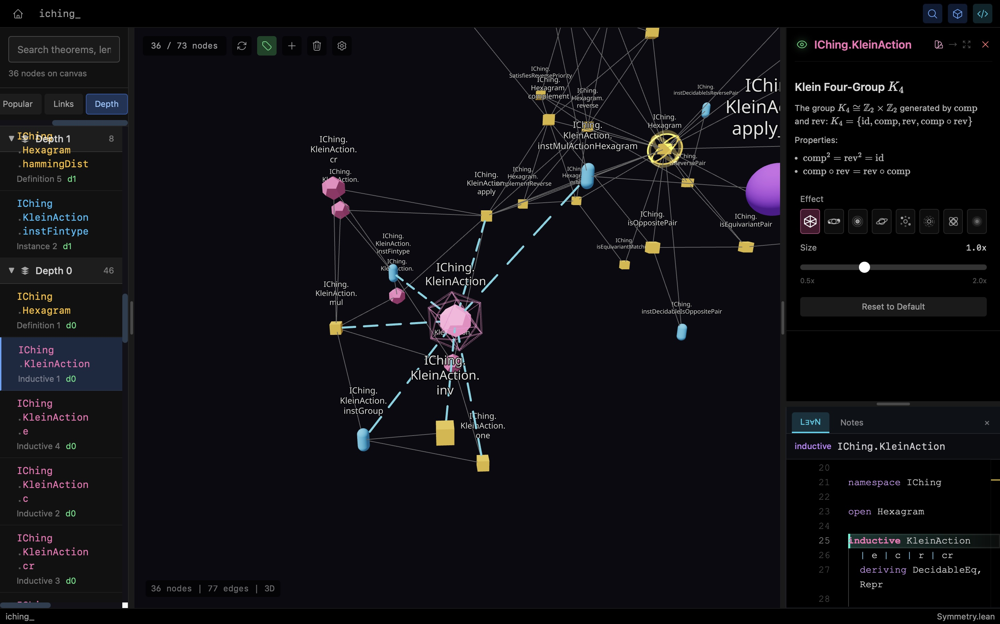

# The Mathematical Structure of the I Ching: From Dialectics to Formal Proof

[](https://youtu.be/4JIzo7qZeaw) [](https://github.com/Xinze-Li-Bryan/Astrolabe)

## Philosophical Foundation of the I Ching

The **I Ching** (Book of Changes) is one of China's oldest philosophical classics, dating back over 3,000 years. Its core idea is to understand the dialectical development of all things in the world through the opposition, unity, transformation, and dynamic balance of contradictions.



### Yin and Yang: The Basic Unit of Contradiction

- **Yang ⚊** (solid line) and **Yin ⚋** (broken line) represent the two opposing aspects of things
- Yin and Yang are not static but dynamic: extreme Yin generates Yang, extreme Yang generates Yin
- Everything can be abstracted as combinations and transformations of Yin and Yang

## The Eight Trigrams: Two Systems of Abstraction

The combination of three Yin-Yang lines yields 8 patterns (trigrams). There are two classical arrangements, each serving a different philosophical purpose:

### Fu Xi's Primordial Bagua (先天八卦) - The Essence (体)

The Primordial Bagua represents the ideal state of the universe, the fundamental principles before manifestation:

| Trigram | Binary | Meaning | Position | Principle |
|---------|--------|---------|----------|-----------|
| ☰ Qian | 111 | Heaven | South | Pure Yang, Creative Force |
| ☷ Kun | 000 | Earth | North | Pure Yin, Receptive Force |
| ☳ Zhen | 001 | Thunder | Northeast | Yang Emerging |
| ☴ Xun | 110 | Wind | Southwest | Yin Entering |
| ☵ Kan | 010 | Water | West | Yang Within Yin |
| ☲ Li | 101 | Fire | East | Yin Within Yang |
| ☶ Gen | 100 | Mountain | Northwest | Yang Culminating |
| ☱ Dui | 011 | Lake | Southeast | Yin Culminating |

**Philosophical Purpose**: The Primordial Bagua is arranged by pure binary opposition - Qian (111) opposes Kun (000), forming perfect symmetry. It represents the cosmic principle (体, essence) - the unchanging mathematical structure underlying reality.

### King Wen's Manifested Bagua (后天八卦) - The Function (用)

The Manifested Bagua represents the actual world as we experience it, with concrete correspondences:

| Trigram | Natural | Direction | Season | Family | Body | Element |
|---------|---------|-----------|--------|--------|------|---------|
| ☰ Qian | Heaven | Northwest | Autumn-Winter | Father | Head | Metal |
| ☷ Kun | Earth | Southwest | Summer-Autumn | Mother | Belly | Earth |
| ☳ Zhen | Thunder | East | Spring Equinox | Eldest Son | Feet | Wood |
| ☵ Kan | Water | North | Winter Solstice | Middle Son | Ears | Water |
| ☶ Gen | Mountain | Northeast | Winter-Spring | Youngest Son | Hands | Earth |
| ☴ Xun | Wind | Southeast | Spring-Summer | Eldest Daughter | Thighs | Wood |
| ☲ Li | Fire | South | Summer Solstice | Middle Daughter | Eyes | Fire |
| ☱ Dui | Lake | West | Autumn Equinox | Youngest Daughter | Mouth | Metal |

**Philosophical Purpose**: The Manifested Bagua describes practical applications (用, function) - how cosmic principles manifest in nature, seasons, human relations, and the body. This is the dialectical abstraction of nature through contradiction.

> **The relationship**: 先天为体，后天为用 (Primordial is essence, Manifested is function) - one is the ideal mathematical structure, the other is how that structure unfolds in reality.

## 64 Hexagrams: Representing Complex Phenomena

Stacking two trigrams creates 64 states (hexagrams), representing more complex dialectical processes:

- **Upper trigram (outer)**: External manifestation, development tendency
- **Lower trigram (inner)**: Internal essence, root cause

## The Dialectical Meaning of Hexagram Operations

Various hexagram transformations in the I Ching are not merely mathematical operations, but different perspectives for observing the dialectical movement of things:

### Complement (comp): The Opposing Side

Flipping all lines (Yin becomes Yang, Yang becomes Yin) gives the complement hexagram (综卦).

**Philosophical meaning**: Everything has its opposite. To understand a thing, one must simultaneously understand its opposite.

- Qian ☰☰ (pure Yang, firmness) complements to Kun ☷☷ (pure Yin, yielding)
- Tai ☷☰ (Peace, prosperity) complements to Pi ☰☷ (Standstill, obstruction)

### Reversal (rev): Shifting Perspective

Turning the hexagram upside down gives the reversed hexagram (覆卦).

**Philosophical meaning**: The same thing appears differently from different angles. Internal and external causes transform into each other.

- Zhun ☵☳ (Difficulty at the Beginning) reverses to Meng ☶☵ (Youthful Folly)
- The shift in perspective reveals another stage of development

### Nuclear (互卦): Internal Logic

Extracting lines 2-5 (discarding the first and sixth) and recombining them.

**Philosophical meaning**: Things develop according to internal necessity. Removing the superficial (first and sixth lines) reveals the essence (the middle four lines).

- The nuclear hexagram reveals the internal mechanism of change
- It's a deepening from phenomenon to essence

### Changing Hexagram (之卦): Transformation of Contradiction

In divination, certain lines "move" (old Yin becomes young Yang, old Yang becomes young Yin), producing a new hexagram.

**Philosophical meaning**: When contradiction accumulates to a certain degree, qualitative change necessarily occurs. Quantitative change leads to qualitative change.

## Mathematical Proof of the King Wen Sequence

King Wen arranged the 64 hexagrams into 32 pairs. This project is an interesting exploration: *Can we prove the King Wen sequence is an optimal solution to a well-defined mathematical problem?*

### Mathematical Framework

- A **hexagram** = 6-bit binary vector $h \in \{0,1\}^6$
- Complement (comp), reversal (rev), and their composition form the **Klein four-group** $K_4$
- **Hamming distance** = "degree of Yin-Yang transformation" between two hexagrams

### The Optimization Problem

Among all pairing schemes using complement or reversal, how can we minimize the total "amount of change" across the 32 pairs?

The solution embodies philosophical intuition:

- **Opposites complement each other**: Opposing things should pair (complement)
- **Angles complement**: Different views of the same thing should pair (reversal)
- **Principle of least action**: Nature chooses the most economical path of change

### The Answer

**Theorem (Uniqueness)**: The optimal pairing strategy is the "reversal-priority rule":

$$\mathrm{partner}(h) = \begin{cases} \mathrm{rev}(h) & \text{if } h \neq \mathrm{rev}(h) \text{ (viewing the same thing from different angles)} \\ \mathrm{comp}(h) & \text{if } h = \mathrm{rev}(h) \text{ (palindrome pairs with its opposite)} \end{cases}$$

**Theorem (King Wen is Optimal)**: The King Wen sequence is isomorphic to this unique optimal pairing.

*What does this mean?* The King Wen sequence not only embodies dialectical thought (unity of opposites, perspective transformation), but is also the most concise and harmonious pairing scheme mathematically.

### Cost Comparison

| Pairing Strategy | Total Hamming Distance | Philosophical Meaning |
|------------------|------------------------|----------------------|
| Complement only | 192 | Only sees opposition, not perspective |
| **Reversal-priority (King Wen)** | **120** | Unity of opposites, complementary perspectives |
| Mixed with comp∘rev | 96 | Mathematically optimal, but loses structure |

The King Wen sequence achieves optimality while maintaining structural simplicity, embodying the philosophy of **"the great Dao is simple"** (大道至简).

## Project Structure

```
├── IChing.lean              # Main entry point
├── IChing/
│   ├── Hexagram.lean        # Hexagram representation, Hamming distance (measure of change)
│   ├── Symmetry.lean        # Klein four-group action (complement, reversal, etc.)
│   ├── KingWen.lean         # King Wen sequence encoding
│   ├── KingWenOptimality.lean  # Optimality and uniqueness proofs
│   └── Canonical.lean       # Equivariant matching definition
├── paper_source.tex         # LaTeX paper with full proofs
└── .astrolabe/              # Astrolabe visualization data
```

## Building

Requires Lean 4 with Lake and Mathlib:

```bash
lake exe cache get    # Download Mathlib cache
lake build            # Build the project
```

## Visualization

This project includes [Astrolabe](https://github.com/Xinze-Li-Bryan/Astrolabe) visualization data (in `.astrolabe/` directory). Open the project in Astrolabe to explore the dependency graph and mathematical annotations, visualizing the logical structure of the proofs.

## Future Directions: Deeper Dialectical Structures

This project only explores Klein four-group symmetry (complement, reversal, etc.). The I Ching tradition contains much richer dialectical structures worth formalizing:

### Additional Hexagram Operations

- **Nuclear hexagram (互卦)**: Reveals internal logic of development
- **Interchange (交卦)**: Upper and lower trigram exchange, internal-external transformation
- **Changing hexagram (之卦)**: Process from quantitative to qualitative change

### Traditional Dialectical Systems

- **Five Elements (五行)**: Wood, Fire, Earth, Metal, Water in generative and destructive cycles (five-element structure of unity of opposites)
- **Bagua Directions (八卦方位)**: Contrast between Primordial Bagua (ideal state, 体) and Manifested Bagua (actual state, 用)
- **Heavenly Stems & Earthly Branches (天干地支)**: 60-cycle of dialectical temporal movement
- **Eight Palaces (八宫)**: Hierarchical classification of 64 hexagrams (development from simple to complex)

### Advanced Topics

- **Astronomical Calendar (天文历法)**: Cyclical movement of heaven-earth Yin-Yang
- **Qimen Dunjia (奇门遁甲)**: Comprehensive dialectical system integrating time-space, directions, and stems-branches

> *Can these systems be formalized in Lean? What hidden dialectical structures would formalization reveal?*

## References

- Wilhelm, R. & Baynes, C.F. (1967). *The I Ching or Book of Changes*. Princeton University Press.
- Leibniz, G.W. (1703). *Explication de l'arithmétique binaire*. Leibniz was the first to discover the connection between I Ching and binary arithmetic.
- *Zhouyi Zhengyi* (周易正义), Kong Yingda's commentary, Tang Dynasty classical annotation.

---

It's real.

Laugh at the end if you get there.
